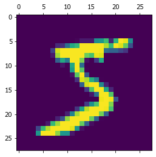
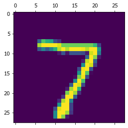
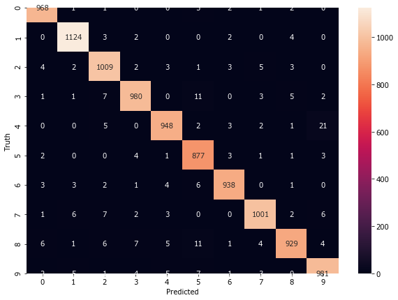

```python
import tensorflow as tf 
from tensorflow import keras
import matplotlib.pyplot as plt 
%matplotlib inline 
import numpy as np
```


```python
(X_train, y_train), (X_test, y_test) = keras.datasets.mnist.load_data()
len(X_train)
```


    60000


```python
len(X_test)
```


    10000


```python
X_train[0].shape
```


    (28, 28)


```python
X_train[0]
```


    array([[  0,   0,   0,   0,   0,   0,   0,   0,   0,   0,   0,   0,   0,
              0,   0,   0,   0,   0,   0,   0,   0,   0,   0,   0,   0,   0,
              0,   0],
           [  0,   0,   0,   0,   0,   0,   0,   0,   0,   0,   0,   0,   0,
              0,   0,   0,   0,   0,   0,   0,   0,   0,   0,   0,   0,   0,
              0,   0],
           [  0,   0,   0,   0,   0,   0,   0,   0,   0,   0,   0,   0,   0,
              0,   0,   0,   0,   0,   0,   0,   0,   0,   0,   0,   0,   0,
              0,   0],
           [  0,   0,   0,   0,   0,   0,   0,   0,   0,   0,   0,   0,   0,
              0,   0,   0,   0,   0,   0,   0,   0,   0,   0,   0,   0,   0,
              0,   0],
           [  0,   0,   0,   0,   0,   0,   0,   0,   0,   0,   0,   0,   0,
              0,   0,   0,   0,   0,   0,   0,   0,   0,   0,   0,   0,   0,
              0,   0],
           [  0,   0,   0,   0,   0,   0,   0,   0,   0,   0,   0,   0,   3,
             18,  18,  18, 126, 136, 175,  26, 166, 255, 247, 127,   0,   0,
              0,   0],
           [  0,   0,   0,   0,   0,   0,   0,   0,  30,  36,  94, 154, 170,
            253, 253, 253, 253, 253, 225, 172, 253, 242, 195,  64,   0,   0,
              0,   0],
           [  0,   0,   0,   0,   0,   0,   0,  49, 238, 253, 253, 253, 253,
            253, 253, 253, 253, 251,  93,  82,  82,  56,  39,   0,   0,   0,
              0,   0],
           [  0,   0,   0,   0,   0,   0,   0,  18, 219, 253, 253, 253, 253,
            253, 198, 182, 247, 241,   0,   0,   0,   0,   0,   0,   0,   0,
              0,   0],
           [  0,   0,   0,   0,   0,   0,   0,   0,  80, 156, 107, 253, 253,
            205,  11,   0,  43, 154,   0,   0,   0,   0,   0,   0,   0,   0,
              0,   0],
           [  0,   0,   0,   0,   0,   0,   0,   0,   0,  14,   1, 154, 253,
             90,   0,   0,   0,   0,   0,   0,   0,   0,   0,   0,   0,   0,
              0,   0],
           [  0,   0,   0,   0,   0,   0,   0,   0,   0,   0,   0, 139, 253,
            190,   2,   0,   0,   0,   0,   0,   0,   0,   0,   0,   0,   0,
              0,   0],
           [  0,   0,   0,   0,   0,   0,   0,   0,   0,   0,   0,  11, 190,
            253,  70,   0,   0,   0,   0,   0,   0,   0,   0,   0,   0,   0,
              0,   0],
           [  0,   0,   0,   0,   0,   0,   0,   0,   0,   0,   0,   0,  35,
            241, 225, 160, 108,   1,   0,   0,   0,   0,   0,   0,   0,   0,
              0,   0],
           [  0,   0,   0,   0,   0,   0,   0,   0,   0,   0,   0,   0,   0,
             81, 240, 253, 253, 119,  25,   0,   0,   0,   0,   0,   0,   0,
              0,   0],
           [  0,   0,   0,   0,   0,   0,   0,   0,   0,   0,   0,   0,   0,
              0,  45, 186, 253, 253, 150,  27,   0,   0,   0,   0,   0,   0,
              0,   0],
           [  0,   0,   0,   0,   0,   0,   0,   0,   0,   0,   0,   0,   0,
              0,   0,  16,  93, 252, 253, 187,   0,   0,   0,   0,   0,   0,
              0,   0],
           [  0,   0,   0,   0,   0,   0,   0,   0,   0,   0,   0,   0,   0,
              0,   0,   0,   0, 249, 253, 249,  64,   0,   0,   0,   0,   0,
              0,   0],
           [  0,   0,   0,   0,   0,   0,   0,   0,   0,   0,   0,   0,   0,
              0,  46, 130, 183, 253, 253, 207,   2,   0,   0,   0,   0,   0,
              0,   0],
           [  0,   0,   0,   0,   0,   0,   0,   0,   0,   0,   0,   0,  39,
            148, 229, 253, 253, 253, 250, 182,   0,   0,   0,   0,   0,   0,
              0,   0],
           [  0,   0,   0,   0,   0,   0,   0,   0,   0,   0,  24, 114, 221,
            253, 253, 253, 253, 201,  78,   0,   0,   0,   0,   0,   0,   0,
              0,   0],
           [  0,   0,   0,   0,   0,   0,   0,   0,  23,  66, 213, 253, 253,
            253, 253, 198,  81,   2,   0,   0,   0,   0,   0,   0,   0,   0,
              0,   0],
           [  0,   0,   0,   0,   0,   0,  18, 171, 219, 253, 253, 253, 253,
            195,  80,   9,   0,   0,   0,   0,   0,   0,   0,   0,   0,   0,
              0,   0],
           [  0,   0,   0,   0,  55, 172, 226, 253, 253, 253, 253, 244, 133,
             11,   0,   0,   0,   0,   0,   0,   0,   0,   0,   0,   0,   0,
              0,   0],
           [  0,   0,   0,   0, 136, 253, 253, 253, 212, 135, 132,  16,   0,
              0,   0,   0,   0,   0,   0,   0,   0,   0,   0,   0,   0,   0,
              0,   0],
           [  0,   0,   0,   0,   0,   0,   0,   0,   0,   0,   0,   0,   0,
              0,   0,   0,   0,   0,   0,   0,   0,   0,   0,   0,   0,   0,
              0,   0],
           [  0,   0,   0,   0,   0,   0,   0,   0,   0,   0,   0,   0,   0,
              0,   0,   0,   0,   0,   0,   0,   0,   0,   0,   0,   0,   0,
              0,   0],
           [  0,   0,   0,   0,   0,   0,   0,   0,   0,   0,   0,   0,   0,
              0,   0,   0,   0,   0,   0,   0,   0,   0,   0,   0,   0,   0,
              0,   0]], dtype=uint8)


```python
plt.matshow(X_train[0])
```


    <matplotlib.image.AxesImage at 0x1b5d65bf550>





```python
y_train[0]
```


    5


```python
X_train = X_train/255 
X_test = X_test/255
X_train[0]
```


    array([[0.        , 0.        , 0.        , 0.        , 0.        ,
            0.        , 0.        , 0.        , 0.        , 0.        ,
            0.        , 0.        , 0.        , 0.        , 0.        ,
            0.        , 0.        , 0.        , 0.        , 0.        ,
            0.        , 0.        , 0.        , 0.        , 0.        ,
            0.        , 0.        , 0.        ],
           [0.        , 0.        , 0.        , 0.        , 0.        ,
            0.        , 0.        , 0.        , 0.        , 0.        ,
            0.        , 0.        , 0.        , 0.        , 0.        ,
            0.        , 0.        , 0.        , 0.        , 0.        ,
            0.        , 0.        , 0.        , 0.        , 0.        ,
            0.        , 0.        , 0.        ],
           [0.        , 0.        , 0.        , 0.        , 0.        ,
            0.        , 0.        , 0.        , 0.        , 0.        ,
            0.        , 0.        , 0.        , 0.        , 0.        ,
            0.        , 0.        , 0.        , 0.        , 0.        ,
            0.        , 0.        , 0.        , 0.        , 0.        ,
            0.        , 0.        , 0.        ],
           [0.        , 0.        , 0.        , 0.        , 0.        ,
            0.        , 0.        , 0.        , 0.        , 0.        ,
            0.        , 0.        , 0.        , 0.        , 0.        ,
            0.        , 0.        , 0.        , 0.        , 0.        ,
            0.        , 0.        , 0.        , 0.        , 0.        ,
            0.        , 0.        , 0.        ],
           [0.        , 0.        , 0.        , 0.        , 0.        ,
            0.        , 0.        , 0.        , 0.        , 0.        ,
            0.        , 0.        , 0.        , 0.        , 0.        ,
            0.        , 0.        , 0.        , 0.        , 0.        ,
            0.        , 0.        , 0.        , 0.        , 0.        ,
            0.        , 0.        , 0.        ],
           [0.        , 0.        , 0.        , 0.        , 0.        ,
            0.        , 0.        , 0.        , 0.        , 0.        ,
            0.        , 0.        , 0.01176471, 0.07058824, 0.07058824,
            0.07058824, 0.49411765, 0.53333333, 0.68627451, 0.10196078,
            0.65098039, 1.        , 0.96862745, 0.49803922, 0.        ,
            0.        , 0.        , 0.        ],
           [0.        , 0.        , 0.        , 0.        , 0.        ,
            0.        , 0.        , 0.        , 0.11764706, 0.14117647,
            0.36862745, 0.60392157, 0.66666667, 0.99215686, 0.99215686,
            0.99215686, 0.99215686, 0.99215686, 0.88235294, 0.6745098 ,
            0.99215686, 0.94901961, 0.76470588, 0.25098039, 0.        ,
            0.        , 0.        , 0.        ],
           [0.        , 0.        , 0.        , 0.        , 0.        ,
            0.        , 0.        , 0.19215686, 0.93333333, 0.99215686,
            0.99215686, 0.99215686, 0.99215686, 0.99215686, 0.99215686,
            0.99215686, 0.99215686, 0.98431373, 0.36470588, 0.32156863,
            0.32156863, 0.21960784, 0.15294118, 0.        , 0.        ,
            0.        , 0.        , 0.        ],
           [0.        , 0.        , 0.        , 0.        , 0.        ,
            0.        , 0.        , 0.07058824, 0.85882353, 0.99215686,
            0.99215686, 0.99215686, 0.99215686, 0.99215686, 0.77647059,
            0.71372549, 0.96862745, 0.94509804, 0.        , 0.        ,
            0.        , 0.        , 0.        , 0.        , 0.        ,
            0.        , 0.        , 0.        ],
           [0.        , 0.        , 0.        , 0.        , 0.        ,
            0.        , 0.        , 0.        , 0.31372549, 0.61176471,
            0.41960784, 0.99215686, 0.99215686, 0.80392157, 0.04313725,
            0.        , 0.16862745, 0.60392157, 0.        , 0.        ,
            0.        , 0.        , 0.        , 0.        , 0.        ,
            0.        , 0.        , 0.        ],
           [0.        , 0.        , 0.        , 0.        , 0.        ,
            0.        , 0.        , 0.        , 0.        , 0.05490196,
            0.00392157, 0.60392157, 0.99215686, 0.35294118, 0.        ,
            0.        , 0.        , 0.        , 0.        , 0.        ,
            0.        , 0.        , 0.        , 0.        , 0.        ,
            0.        , 0.        , 0.        ],
           [0.        , 0.        , 0.        , 0.        , 0.        ,
            0.        , 0.        , 0.        , 0.        , 0.        ,
            0.        , 0.54509804, 0.99215686, 0.74509804, 0.00784314,
            0.        , 0.        , 0.        , 0.        , 0.        ,
            0.        , 0.        , 0.        , 0.        , 0.        ,
            0.        , 0.        , 0.        ],
           [0.        , 0.        , 0.        , 0.        , 0.        ,
            0.        , 0.        , 0.        , 0.        , 0.        ,
            0.        , 0.04313725, 0.74509804, 0.99215686, 0.2745098 ,
            0.        , 0.        , 0.        , 0.        , 0.        ,
            0.        , 0.        , 0.        , 0.        , 0.        ,
            0.        , 0.        , 0.        ],
           [0.        , 0.        , 0.        , 0.        , 0.        ,
            0.        , 0.        , 0.        , 0.        , 0.        ,
            0.        , 0.        , 0.1372549 , 0.94509804, 0.88235294,
            0.62745098, 0.42352941, 0.00392157, 0.        , 0.        ,
            0.        , 0.        , 0.        , 0.        , 0.        ,
            0.        , 0.        , 0.        ],
           [0.        , 0.        , 0.        , 0.        , 0.        ,
            0.        , 0.        , 0.        , 0.        , 0.        ,
            0.        , 0.        , 0.        , 0.31764706, 0.94117647,
            0.99215686, 0.99215686, 0.46666667, 0.09803922, 0.        ,
            0.        , 0.        , 0.        , 0.        , 0.        ,
            0.        , 0.        , 0.        ],
           [0.        , 0.        , 0.        , 0.        , 0.        ,
            0.        , 0.        , 0.        , 0.        , 0.        ,
            0.        , 0.        , 0.        , 0.        , 0.17647059,
            0.72941176, 0.99215686, 0.99215686, 0.58823529, 0.10588235,
            0.        , 0.        , 0.        , 0.        , 0.        ,
            0.        , 0.        , 0.        ],
           [0.        , 0.        , 0.        , 0.        , 0.        ,
            0.        , 0.        , 0.        , 0.        , 0.        ,
            0.        , 0.        , 0.        , 0.        , 0.        ,
            0.0627451 , 0.36470588, 0.98823529, 0.99215686, 0.73333333,
            0.        , 0.        , 0.        , 0.        , 0.        ,
            0.        , 0.        , 0.        ],
           [0.        , 0.        , 0.        , 0.        , 0.        ,
            0.        , 0.        , 0.        , 0.        , 0.        ,
            0.        , 0.        , 0.        , 0.        , 0.        ,
            0.        , 0.        , 0.97647059, 0.99215686, 0.97647059,
            0.25098039, 0.        , 0.        , 0.        , 0.        ,
            0.        , 0.        , 0.        ],
           [0.        , 0.        , 0.        , 0.        , 0.        ,
            0.        , 0.        , 0.        , 0.        , 0.        ,
            0.        , 0.        , 0.        , 0.        , 0.18039216,
            0.50980392, 0.71764706, 0.99215686, 0.99215686, 0.81176471,
            0.00784314, 0.        , 0.        , 0.        , 0.        ,
            0.        , 0.        , 0.        ],
           [0.        , 0.        , 0.        , 0.        , 0.        ,
            0.        , 0.        , 0.        , 0.        , 0.        ,
            0.        , 0.        , 0.15294118, 0.58039216, 0.89803922,
            0.99215686, 0.99215686, 0.99215686, 0.98039216, 0.71372549,
            0.        , 0.        , 0.        , 0.        , 0.        ,
            0.        , 0.        , 0.        ],
           [0.        , 0.        , 0.        , 0.        , 0.        ,
            0.        , 0.        , 0.        , 0.        , 0.        ,
            0.09411765, 0.44705882, 0.86666667, 0.99215686, 0.99215686,
            0.99215686, 0.99215686, 0.78823529, 0.30588235, 0.        ,
            0.        , 0.        , 0.        , 0.        , 0.        ,
            0.        , 0.        , 0.        ],
           [0.        , 0.        , 0.        , 0.        , 0.        ,
            0.        , 0.        , 0.        , 0.09019608, 0.25882353,
            0.83529412, 0.99215686, 0.99215686, 0.99215686, 0.99215686,
            0.77647059, 0.31764706, 0.00784314, 0.        , 0.        ,
            0.        , 0.        , 0.        , 0.        , 0.        ,
            0.        , 0.        , 0.        ],
           [0.        , 0.        , 0.        , 0.        , 0.        ,
            0.        , 0.07058824, 0.67058824, 0.85882353, 0.99215686,
            0.99215686, 0.99215686, 0.99215686, 0.76470588, 0.31372549,
            0.03529412, 0.        , 0.        , 0.        , 0.        ,
            0.        , 0.        , 0.        , 0.        , 0.        ,
            0.        , 0.        , 0.        ],
           [0.        , 0.        , 0.        , 0.        , 0.21568627,
            0.6745098 , 0.88627451, 0.99215686, 0.99215686, 0.99215686,
            0.99215686, 0.95686275, 0.52156863, 0.04313725, 0.        ,
            0.        , 0.        , 0.        , 0.        , 0.        ,
            0.        , 0.        , 0.        , 0.        , 0.        ,
            0.        , 0.        , 0.        ],
           [0.        , 0.        , 0.        , 0.        , 0.53333333,
            0.99215686, 0.99215686, 0.99215686, 0.83137255, 0.52941176,
            0.51764706, 0.0627451 , 0.        , 0.        , 0.        ,
            0.        , 0.        , 0.        , 0.        , 0.        ,
            0.        , 0.        , 0.        , 0.        , 0.        ,
            0.        , 0.        , 0.        ],
           [0.        , 0.        , 0.        , 0.        , 0.        ,
            0.        , 0.        , 0.        , 0.        , 0.        ,
            0.        , 0.        , 0.        , 0.        , 0.        ,
            0.        , 0.        , 0.        , 0.        , 0.        ,
            0.        , 0.        , 0.        , 0.        , 0.        ,
            0.        , 0.        , 0.        ],
           [0.        , 0.        , 0.        , 0.        , 0.        ,
            0.        , 0.        , 0.        , 0.        , 0.        ,
            0.        , 0.        , 0.        , 0.        , 0.        ,
            0.        , 0.        , 0.        , 0.        , 0.        ,
            0.        , 0.        , 0.        , 0.        , 0.        ,
            0.        , 0.        , 0.        ],
           [0.        , 0.        , 0.        , 0.        , 0.        ,
            0.        , 0.        , 0.        , 0.        , 0.        ,
            0.        , 0.        , 0.        , 0.        , 0.        ,
            0.        , 0.        , 0.        , 0.        , 0.        ,
            0.        , 0.        , 0.        , 0.        , 0.        ,
            0.        , 0.        , 0.        ]])


```python
X_train_flattened = X_train.reshape(len(X_train),28*28)
X_test_flattened = X_test.reshape(len(X_test),28*28)
X_train_flattened

```


    array([[0., 0., 0., ..., 0., 0., 0.],
           [0., 0., 0., ..., 0., 0., 0.],
           [0., 0., 0., ..., 0., 0., 0.],
           ...,
           [0., 0., 0., ..., 0., 0., 0.],
           [0., 0., 0., ..., 0., 0., 0.],
           [0., 0., 0., ..., 0., 0., 0.]])


```python
X_train_flattened[0]
```


    array([0.        , 0.        , 0.        , 0.        , 0.        ,
           0.        , 0.        , 0.        , 0.        , 0.        ,
           0.        , 0.        , 0.        , 0.        , 0.        ,
           0.        , 0.        , 0.        , 0.        , 0.        ,
           0.        , 0.        , 0.        , 0.        , 0.        ,
           0.        , 0.        , 0.        , 0.        , 0.        ,
           0.        , 0.        , 0.        , 0.        , 0.        ,
           0.        , 0.        , 0.        , 0.        , 0.        ,
           0.        , 0.        , 0.        , 0.        , 0.        ,
           0.        , 0.        , 0.        , 0.        , 0.        ,
           0.        , 0.        , 0.        , 0.        , 0.        ,
           0.        , 0.        , 0.        , 0.        , 0.        ,
           0.        , 0.        , 0.        , 0.        , 0.        ,
           0.        , 0.        , 0.        , 0.        , 0.        ,
           0.        , 0.        , 0.        , 0.        , 0.        ,
           0.        , 0.        , 0.        , 0.        , 0.        ,
           0.        , 0.        , 0.        , 0.        , 0.        ,
           0.        , 0.        , 0.        , 0.        , 0.        ,
           0.        , 0.        , 0.        , 0.        , 0.        ,
           0.        , 0.        , 0.        , 0.        , 0.        ,
           0.        , 0.        , 0.        , 0.        , 0.        ,
           0.        , 0.        , 0.        , 0.        , 0.        ,
           0.        , 0.        , 0.        , 0.        , 0.        ,
           0.        , 0.        , 0.        , 0.        , 0.        ,
           0.        , 0.        , 0.        , 0.        , 0.        ,
           0.        , 0.        , 0.        , 0.        , 0.        ,
           0.        , 0.        , 0.        , 0.        , 0.        ,
           0.        , 0.        , 0.        , 0.        , 0.        ,
           0.        , 0.        , 0.        , 0.        , 0.        ,
           0.        , 0.        , 0.        , 0.        , 0.        ,
           0.        , 0.        , 0.01176471, 0.07058824, 0.07058824,
           0.07058824, 0.49411765, 0.53333333, 0.68627451, 0.10196078,
           0.65098039, 1.        , 0.96862745, 0.49803922, 0.        ,
           0.        , 0.        , 0.        , 0.        , 0.        ,
           0.        , 0.        , 0.        , 0.        , 0.        ,
           0.        , 0.11764706, 0.14117647, 0.36862745, 0.60392157,
           0.66666667, 0.99215686, 0.99215686, 0.99215686, 0.99215686,
           0.99215686, 0.88235294, 0.6745098 , 0.99215686, 0.94901961,
           0.76470588, 0.25098039, 0.        , 0.        , 0.        ,
           0.        , 0.        , 0.        , 0.        , 0.        ,
           0.        , 0.        , 0.        , 0.19215686, 0.93333333,
           0.99215686, 0.99215686, 0.99215686, 0.99215686, 0.99215686,
           0.99215686, 0.99215686, 0.99215686, 0.98431373, 0.36470588,
           0.32156863, 0.32156863, 0.21960784, 0.15294118, 0.        ,
           0.        , 0.        , 0.        , 0.        , 0.        ,
           0.        , 0.        , 0.        , 0.        , 0.        ,
           0.        , 0.07058824, 0.85882353, 0.99215686, 0.99215686,
           0.99215686, 0.99215686, 0.99215686, 0.77647059, 0.71372549,
           0.96862745, 0.94509804, 0.        , 0.        , 0.        ,
           0.        , 0.        , 0.        , 0.        , 0.        ,
           0.        , 0.        , 0.        , 0.        , 0.        ,
           0.        , 0.        , 0.        , 0.        , 0.        ,
           0.31372549, 0.61176471, 0.41960784, 0.99215686, 0.99215686,
           0.80392157, 0.04313725, 0.        , 0.16862745, 0.60392157,
           0.        , 0.        , 0.        , 0.        , 0.        ,
           0.        , 0.        , 0.        , 0.        , 0.        ,
           0.        , 0.        , 0.        , 0.        , 0.        ,
           0.        , 0.        , 0.        , 0.        , 0.05490196,
           0.00392157, 0.60392157, 0.99215686, 0.35294118, 0.        ,
           0.        , 0.        , 0.        , 0.        , 0.        ,
           0.        , 0.        , 0.        , 0.        , 0.        ,
           0.        , 0.        , 0.        , 0.        , 0.        ,
           0.        , 0.        , 0.        , 0.        , 0.        ,
           0.        , 0.        , 0.        , 0.        , 0.54509804,
           0.99215686, 0.74509804, 0.00784314, 0.        , 0.        ,
           0.        , 0.        , 0.        , 0.        , 0.        ,
           0.        , 0.        , 0.        , 0.        , 0.        ,
           0.        , 0.        , 0.        , 0.        , 0.        ,
           0.        , 0.        , 0.        , 0.        , 0.        ,
           0.        , 0.        , 0.04313725, 0.74509804, 0.99215686,
           0.2745098 , 0.        , 0.        , 0.        , 0.        ,
           0.        , 0.        , 0.        , 0.        , 0.        ,
           0.        , 0.        , 0.        , 0.        , 0.        ,
           0.        , 0.        , 0.        , 0.        , 0.        ,
           0.        , 0.        , 0.        , 0.        , 0.        ,
           0.        , 0.1372549 , 0.94509804, 0.88235294, 0.62745098,
           0.42352941, 0.00392157, 0.        , 0.        , 0.        ,
           0.        , 0.        , 0.        , 0.        , 0.        ,
           0.        , 0.        , 0.        , 0.        , 0.        ,
           0.        , 0.        , 0.        , 0.        , 0.        ,
           0.        , 0.        , 0.        , 0.        , 0.        ,
           0.31764706, 0.94117647, 0.99215686, 0.99215686, 0.46666667,
           0.09803922, 0.        , 0.        , 0.        , 0.        ,
           0.        , 0.        , 0.        , 0.        , 0.        ,
           0.        , 0.        , 0.        , 0.        , 0.        ,
           0.        , 0.        , 0.        , 0.        , 0.        ,
           0.        , 0.        , 0.        , 0.        , 0.17647059,
           0.72941176, 0.99215686, 0.99215686, 0.58823529, 0.10588235,
           0.        , 0.        , 0.        , 0.        , 0.        ,
           0.        , 0.        , 0.        , 0.        , 0.        ,
           0.        , 0.        , 0.        , 0.        , 0.        ,
           0.        , 0.        , 0.        , 0.        , 0.        ,
           0.        , 0.        , 0.        , 0.0627451 , 0.36470588,
           0.98823529, 0.99215686, 0.73333333, 0.        , 0.        ,
           0.        , 0.        , 0.        , 0.        , 0.        ,
           0.        , 0.        , 0.        , 0.        , 0.        ,
           0.        , 0.        , 0.        , 0.        , 0.        ,
           0.        , 0.        , 0.        , 0.        , 0.        ,
           0.        , 0.        , 0.        , 0.97647059, 0.99215686,
           0.97647059, 0.25098039, 0.        , 0.        , 0.        ,
           0.        , 0.        , 0.        , 0.        , 0.        ,
           0.        , 0.        , 0.        , 0.        , 0.        ,
           0.        , 0.        , 0.        , 0.        , 0.        ,
           0.        , 0.        , 0.        , 0.18039216, 0.50980392,
           0.71764706, 0.99215686, 0.99215686, 0.81176471, 0.00784314,
           0.        , 0.        , 0.        , 0.        , 0.        ,
           0.        , 0.        , 0.        , 0.        , 0.        ,
           0.        , 0.        , 0.        , 0.        , 0.        ,
           0.        , 0.        , 0.        , 0.        , 0.15294118,
           0.58039216, 0.89803922, 0.99215686, 0.99215686, 0.99215686,
           0.98039216, 0.71372549, 0.        , 0.        , 0.        ,
           0.        , 0.        , 0.        , 0.        , 0.        ,
           0.        , 0.        , 0.        , 0.        , 0.        ,
           0.        , 0.        , 0.        , 0.        , 0.        ,
           0.09411765, 0.44705882, 0.86666667, 0.99215686, 0.99215686,
           0.99215686, 0.99215686, 0.78823529, 0.30588235, 0.        ,
           0.        , 0.        , 0.        , 0.        , 0.        ,
           0.        , 0.        , 0.        , 0.        , 0.        ,
           0.        , 0.        , 0.        , 0.        , 0.        ,
           0.        , 0.09019608, 0.25882353, 0.83529412, 0.99215686,
           0.99215686, 0.99215686, 0.99215686, 0.77647059, 0.31764706,
           0.00784314, 0.        , 0.        , 0.        , 0.        ,
           0.        , 0.        , 0.        , 0.        , 0.        ,
           0.        , 0.        , 0.        , 0.        , 0.        ,
           0.        , 0.        , 0.07058824, 0.67058824, 0.85882353,
           0.99215686, 0.99215686, 0.99215686, 0.99215686, 0.76470588,
           0.31372549, 0.03529412, 0.        , 0.        , 0.        ,
           0.        , 0.        , 0.        , 0.        , 0.        ,
           0.        , 0.        , 0.        , 0.        , 0.        ,
           0.        , 0.        , 0.        , 0.21568627, 0.6745098 ,
           0.88627451, 0.99215686, 0.99215686, 0.99215686, 0.99215686,
           0.95686275, 0.52156863, 0.04313725, 0.        , 0.        ,
           0.        , 0.        , 0.        , 0.        , 0.        ,
           0.        , 0.        , 0.        , 0.        , 0.        ,
           0.        , 0.        , 0.        , 0.        , 0.        ,
           0.        , 0.53333333, 0.99215686, 0.99215686, 0.99215686,
           0.83137255, 0.52941176, 0.51764706, 0.0627451 , 0.        ,
           0.        , 0.        , 0.        , 0.        , 0.        ,
           0.        , 0.        , 0.        , 0.        , 0.        ,
           0.        , 0.        , 0.        , 0.        , 0.        ,
           0.        , 0.        , 0.        , 0.        , 0.        ,
           0.        , 0.        , 0.        , 0.        , 0.        ,
           0.        , 0.        , 0.        , 0.        , 0.        ,
           0.        , 0.        , 0.        , 0.        , 0.        ,
           0.        , 0.        , 0.        , 0.        , 0.        ,
           0.        , 0.        , 0.        , 0.        , 0.        ,
           0.        , 0.        , 0.        , 0.        , 0.        ,
           0.        , 0.        , 0.        , 0.        , 0.        ,
           0.        , 0.        , 0.        , 0.        , 0.        ,
           0.        , 0.        , 0.        , 0.        , 0.        ,
           0.        , 0.        , 0.        , 0.        , 0.        ,
           0.        , 0.        , 0.        , 0.        , 0.        ,
           0.        , 0.        , 0.        , 0.        , 0.        ,
           0.        , 0.        , 0.        , 0.        , 0.        ,
           0.        , 0.        , 0.        , 0.        , 0.        ,
           0.        , 0.        , 0.        , 0.        , 0.        ,
           0.        , 0.        , 0.        , 0.        ])


```python
model = keras.Sequential([
    keras.layers.Dense(10, input_shape=(784,), activation='sigmoid')
])

model.compile(optimizer='adam',
             loss='sparse_categorical_crossentropy',
              metrics = ['accuracy']
             )
model.fit(X_train_flattened, y_train, epochs=5)
```

    WARNING:tensorflow:From C:\Users\ASUS\Anaconda3\envs\tensorflow\lib\site-packages\tensorflow\python\ops\resource_variable_ops.py:435: colocate_with (from tensorflow.python.framework.ops) is deprecated and will be removed in a future version.
    Instructions for updating:
    Colocations handled automatically by placer.
    Epoch 1/5
    60000/60000 [==============================] - 3s 49us/sample - loss: 0.4918 - acc: 0.8775
    Epoch 2/5
    60000/60000 [==============================] - 3s 44us/sample - loss: 0.3067 - acc: 0.9155
    Epoch 3/5
    60000/60000 [==============================] - 3s 44us/sample - loss: 0.2852 - acc: 0.9212
    Epoch 4/5
    60000/60000 [==============================] - 3s 45us/sample - loss: 0.2747 - acc: 0.9248
    Epoch 5/5
    60000/60000 [==============================] - 3s 45us/sample - loss: 0.2676 - acc: 0.9263
    


    <tensorflow.python.keras.callbacks.History at 0x1b5d5f06860>


```python
model.evaluate(X_test_flattened, y_test)
```

    10000/10000 [==============================] - 0s 36us/sample - loss: 0.2654 - acc: 0.9253
    


    [0.2654161608934402, 0.9253]


```python
y_predicted = model.predict(X_test_flattened)
y_predicted[0]
```


    array([1.5735626e-05, 0.0000000e+00, 3.1173229e-05, 1.2584895e-02,
           9.5367432e-07, 7.4535608e-05, 0.0000000e+00, 7.7066624e-01,
           6.3508749e-05, 8.9848042e-04], dtype=float32)


```python
plt.matshow(X_test[0])
```


    <matplotlib.image.AxesImage at 0x1b5d6193e10>





```python
np.argmax(y_predicted[0])
```


    7


```python
y_predicted_labels = [np.argmax(i) for i in y_predicted]
y_predicted_labels[:5]
```


    [7, 2, 1, 0, 4]


```python
cm = tf.math.confusion_matrix(labels=y_test, predictions=y_predicted_labels)
cm
```


    <tf.Tensor 'confusion_matrix_13/SparseTensorDenseAdd:0' shape=(10, 10) dtype=int32>


```python
from sklearn.metrics import confusion_matrix
```


```python
cm = confusion_matrix(y_test, y_predicted_labels)
```


```python
import seaborn as sn 
plt.figure(figsize = (10,7))
sn.heatmap(cm, annot=True, fmt='d')
plt.xlabel('Predicted')
plt.ylabel('Truth')
```


    Text(69.0, 0.5, 'Truth')


```python
model = keras.Sequential([
    keras.layers.Dense(100, input_shape=(784,), activation='relu'),
    keras.layers.Dense(10, activation='sigmoid')
])

model.compile(optimizer='adam',
             loss='sparse_categorical_crossentropy',
              metrics = ['accuracy']
             )
model.fit(X_train_flattened, y_train, epochs=5)
```

    Epoch 1/5
    60000/60000 [==============================] - 5s 86us/sample - loss: 0.3047 - acc: 0.9141
    Epoch 2/5
    60000/60000 [==============================] - 4s 69us/sample - loss: 0.1447 - acc: 0.9576
    Epoch 3/5
    60000/60000 [==============================] - 4s 73us/sample - loss: 0.1043 - acc: 0.9691
    Epoch 4/5
    60000/60000 [==============================] - 4s 69us/sample - loss: 0.0807 - acc: 0.9755
    Epoch 5/5
    60000/60000 [==============================] - 4s 69us/sample - loss: 0.0670 - acc: 0.9800
    


    <tensorflow.python.keras.callbacks.History at 0x1b5fbecfdd8>


```python
model.evaluate(X_test_flattened, y_test)
```

    10000/10000 [==============================] - 1s 51us/sample - loss: 0.0872 - acc: 0.9734
    


    [0.0872325284652412, 0.9734]


```python
y_predicted = model.predict(X_test_flattened)
```


```python
y_predicted
```


    array([[2.3245811e-06, 5.9604645e-08, 6.9737434e-06, ..., 8.2526267e-01,
            9.4175339e-06, 1.3986230e-04],
           [4.2617321e-06, 1.5795231e-04, 9.7296548e-01, ..., 0.0000000e+00,
            2.5570393e-05, 0.0000000e+00],
           [6.8545341e-07, 3.3836278e-01, 9.2896819e-04, ..., 3.5876036e-04,
            3.2433867e-04, 7.8976154e-06],
           ...,
           [0.0000000e+00, 0.0000000e+00, 0.0000000e+00, ..., 3.3378601e-06,
            4.5597553e-06, 3.3810735e-04],
           [0.0000000e+00, 0.0000000e+00, 0.0000000e+00, ..., 5.3644180e-07,
            2.1281838e-04, 0.0000000e+00],
           [0.0000000e+00, 0.0000000e+00, 8.9406967e-08, ..., 0.0000000e+00,
            0.0000000e+00, 0.0000000e+00]], dtype=float32)


```python
y_predicted_labels = [np.argmax(i) for i in y_predicted]

```


```python
cm = confusion_matrix(y_test, y_predicted_labels)
```


```python
plt.figure(figsize = (10,7))
sn.heatmap(cm, annot=True, fmt='d')
plt.xlabel('Predicted')
plt.ylabel('Truth')
```


    Text(69.0, 0.5, 'Truth')


```python
model = keras.Sequential([
    keras.layers.Flatten(input_shape=(28,28)),
    keras.layers.Dense(100, activation='relu'),
    keras.layers.Dense(10, activation='sigmoid')
])

model.compile(optimizer='adam',
             loss='sparse_categorical_crossentropy',
              metrics = ['accuracy']
             )
model.fit(X_train, y_train, epochs=10)
```

    Epoch 1/10
    60000/60000 [==============================] - 5s 81us/sample - loss: 0.2930 - acc: 0.9188
    Epoch 2/10
    60000/60000 [==============================] - 4s 72us/sample - loss: 0.1361 - acc: 0.9599
    Epoch 3/10
    60000/60000 [==============================] - 4s 73us/sample - loss: 0.0993 - acc: 0.9702
    Epoch 4/10
    60000/60000 [==============================] - 5s 77us/sample - loss: 0.0778 - acc: 0.9761
    Epoch 5/10
    60000/60000 [==============================] - 4s 73us/sample - loss: 0.0641 - acc: 0.9801
    Epoch 6/10
    60000/60000 [==============================] - 4s 72us/sample - loss: 0.0533 - acc: 0.9838
    Epoch 7/10
    60000/60000 [==============================] - 5s 78us/sample - loss: 0.0425 - acc: 0.9868
    Epoch 8/10
    60000/60000 [==============================] - 5s 82us/sample - loss: 0.0370 - acc: 0.9887
    Epoch 9/10
    60000/60000 [==============================] - 4s 75us/sample - loss: 0.0312 - acc: 0.9906
    Epoch 10/10
    60000/60000 [==============================] - 4s 74us/sample - loss: 0.0264 - acc: 0.9920
    


    <tensorflow.python.keras.callbacks.History at 0x1b588971160>


```python
model.evaluate(X_test, y_test)
```

    10000/10000 [==============================] - 0s 43us/sample - loss: 0.0851 - acc: 0.9755
    


    [0.08512603248046943, 0.9755]


```python
y_predicted = model.predict(X_test)
```


```python
y_predicted
```


    array([[0.0000000e+00, 0.0000000e+00, 7.7486038e-07, ..., 7.3411363e-01,
            0.0000000e+00, 3.7252903e-06],
           [0.0000000e+00, 5.9604645e-08, 2.6673341e-01, ..., 0.0000000e+00,
            8.9406967e-08, 0.0000000e+00],
           [2.6822090e-07, 4.9645683e-01, 7.8767538e-05, ..., 3.2556057e-04,
            3.6060810e-05, 5.9604645e-08],
           ...,
           [0.0000000e+00, 0.0000000e+00, 0.0000000e+00, ..., 5.9604645e-08,
            8.9406967e-08, 6.5416098e-05],
           [0.0000000e+00, 0.0000000e+00, 0.0000000e+00, ..., 0.0000000e+00,
            7.0989132e-05, 0.0000000e+00],
           [0.0000000e+00, 0.0000000e+00, 0.0000000e+00, ..., 0.0000000e+00,
            0.0000000e+00, 0.0000000e+00]], dtype=float32)


```python
y_predicted_labels = [np.argmax(i) for i in y_predicted]
```


```python
cm = confusion_matrix(y_test, y_predicted_labels)
```


```python
plt.figure(figsize = (10,7))
sn.heatmap(cm, annot=True, fmt='d')
plt.xlabel('Predicted')
plt.ylabel('Truth')
```


    Text(69.0, 0.5, 'Truth')





```python

```
